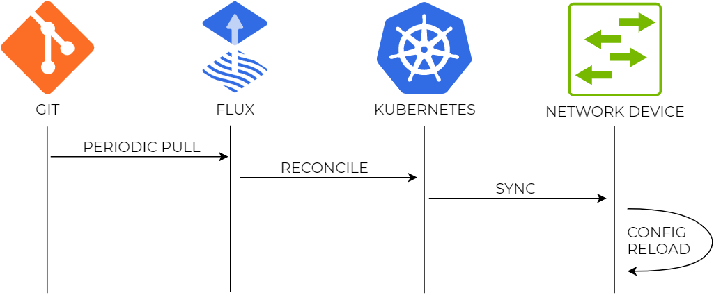
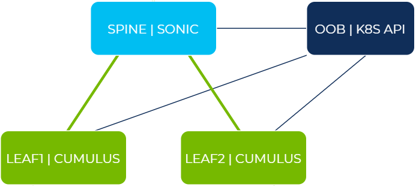

# Kubernetes on Baremetal Network

The goal of this demo is to show how to manage the configuration of data centre network devices using GitOps-orchestrated Kubernetes resources. In our case we'll be using [flux](https://fluxcd.io/docs/get-started/) as the orchestration engine that periodically pulls resources from a central Git repository and reconciles them on the local Kubernetes cluster, i.e. makes sure all resources are exactly the same as in the source repository.

Each network device is running a simple agent that monitors certain Kubernetes resources and reloads network configuration when it detects any changes. This way all changes are propagated from the central Git repository to a network device without any human intervention, which is also an example of network configuration continuous delivery (CD).



This approach has several benefits when compared to the standard human-triggered push model:

* All changes can be peer-reviewed and tested before they get merged into the `main` branch.
* All configuration state of the network is logged so it's always clear who did a change, why it was done and when.
* Git becomes the source of truth for all network state, any externally-introduced state is wiped out.
* The state can be retrieved at any stage using the Kubernetes APIs.


## Lab details 

The lab consists of 3 network devices -- two leaf switches running Cumulus Linux and a spine switch running SONiC. The Kubernetes API server is residing in the out-of-band management network and all network devices have kubelet installed and connected to the API server over the OOB network.



All devices start with default configuration, management IPs are allocated by the DHCP server running on the `OOB` node. Each device is configured in its own unique way:

* **leaf1** is configured via individual agents like `frr` and `ifupdown2`. 
* **leaf2** is managed using NVUE data models via REST API. 
* **spine** is configured by replacing a `config_db.json` file and telling SONiC to reload its configuration.

> [NOTE 1] To learn how to install kubelet on Cumulus and SONiC and taint the nodes to prevent them from running unwanted containers, see the [`./air`](https://gitlab.com/nvidia-networking/systems-engineering/poc-support/kubernetes-on-baremetal-network/-/tree/main/air) directory.

> [NOTE 2] For more details about the "config reload" agent -- how it works and what assumption it makes, see [`./docker`](https://gitlab.com/nvidia-networking/systems-engineering/poc-support/kubernetes-on-baremetal-network/-/tree/main/docker).


## Demo walkthrough

### 1. Make a private fork/clone of this repository 

This is required in order to be able to make changes and push them into the repository. 

```
git clone https://gitlab.com/nvidia-networking/systems-engineering/poc-support/kubernetes-on-baremetal-network.git

cd kubernetes-on-baremetal-network

git remote remove origin

git remote add origin <Private Git Repo URL>
```

Make sure the repository is public to allow `flux` to pull it without credentials.

### 2. Create a Marketplace Demo

<!--
https://air.nvidia.com/api/v1/simulation/autoprovision/?simulation_id=bc4042b3-eff0-4034-b84d-4cf153008eec
-->


### 3. Install Flux

From the `oob-mgmt-server` ssh into the `netq-ts` node, which is running the Kubernetes control plane, and run the following commands:

```
cumulus@netq-ts:~$ sudo -i

curl -s https://fluxcd.io/install.sh | sudo bash

flux install --namespace=flux-system --watch-all-namespaces=true
```

This will install flux CLI and install all the required Flux controllers (Git, Helm, Kustomize) into the local Kubernetes cluster. Check that all Flux components are running on the `neq-ts` node.

```
root@netq-ts:~# kubectl -n flux-system get deploy
NAME                      READY   UP-TO-DATE   AVAILABLE   AGE
helm-controller           1/1     1            1           29s
kustomize-controller      1/1     1            1           29s
notification-controller   1/1     1            1           29s
source-controller         1/1     1            1           29s
```

### 4. Create a GitRepo resource

Flux manages a number of Kubernetes custom resources:

```
root@netq-ts:~# kubectl api-resources | grep fluxcd
helmreleases                      hr           helm.toolkit.fluxcd.io                         true         HelmRelease
kustomizations                    ks           kustomize.toolkit.fluxcd.io                    true         Kustomization
alerts                                         notification.toolkit.fluxcd.io                 true         Alert
providers                                      notification.toolkit.fluxcd.io                 true         Provider
receivers                                      notification.toolkit.fluxcd.io                 true         Receiver
buckets                                        source.toolkit.fluxcd.io                       true         Bucket
gitrepositories                   gitrepo      source.toolkit.fluxcd.io                       true         GitRepository
helmcharts                        hc           source.toolkit.fluxcd.io                       true         HelmChart
helmrepositories                  helmrepo     source.toolkit.fluxcd.io                       true         HelmRepository
```

Create a `gitrepository` resource and point it at your private Git repository created earlier (replace the URL below with the HTTPS URL of your public Git repo).

```
flux create source git network \
--url=https://gitlab.com/nvidia-networking/systems-engineering/poc-support/kubernetes-on-baremetal-network \
--branch=main \
--interval=10s
```

If flux was able to successfully pull the specified repository, it will update the status of the resource to `READY`:

```
root@netq-ts:~# kubectl -n flux-system get gitrepository
NAME      URL                                                                                                    READY   STATUS                                                            AGE
network   https://gitlab.com/nvidia-networking/systems-engineering/poc-support/kubernetes-on-baremetal-network   True    Fetched revision: main/db600c7531a205a6de8110932d1f5e83b00637e9   5s
```


### 5. Create a kustomization resource for dc network

Now we need to tell flux where exactly in the repository should it look for the Kubernetes manifests to reconcile. The reconciliation process is done by the kustomization controller so we need to create a resource that will:

* Reference the previously created git repository
* Provide the path with Kubernetes manifests
* Define reconciliation interval and target namespace


```
flux create kustomization dc-network  \
 --source=GitRepository/network  \
  --path="./manifests/overlays/dc1"   \
  --prune=true   \
  --interval=10s \
  --target-namespace=dc1
```

This resource will ensure all Kubernetes resources from the specified path a reconciled (created and applied) on a local Kubernetes cluster. Confirm that all manifests have been applied:

```
root@netq-ts:~# kubectl get kustomization -n flux-system
NAME         READY   STATUS                                                            AGE
dc-network   True    Applied revision: main/db600c7531a205a6de8110932d1f5e83b00637e9   15s
```

>  For more details about how GitOps is configured to work under the hood see the [`./gitops.md`](https://gitlab.com/nvidia-networking/systems-engineering/poc-support/kubernetes-on-baremetal-network/-/blob/main/gitops.md)


### 6. Observe applied changes

Before the changes were applied we would've seen no non-default IPs configured on loopback interfaces:

```
cumulus@oob-mgmt-server:~$ ssh leaf1 -C 'ip -br addr show dev lo'; ssh leaf2 -C 'ip -br addr show dev lo'; ssh admin@spine -C 'ip -br addr show dev Loopback0'
lo               UNKNOWN        127.0.0.1/8 ::1/128
lo               UNKNOWN        127.0.0.1/8 ::1/128
Loopback0        UNKNOWN        10.255.255.1/32 fe80::1081:85ff:fe0f:4546/64
```

After the changes are applied, we should now be able to see the loopback IPs from the `192.0.2.0/24` range:

```
cumulus@oob-mgmt-server:~$ ssh leaf1 -C 'ip -br addr show dev lo'; ssh leaf2 -C 'ip -br addr show dev lo'; ssh admin@spine -C 'ip -br addr show dev Loopback0'
lo               UNKNOWN        127.0.0.1/8 192.0.2.1/32 ::1/128
lo               UNKNOWN        127.0.0.1/8 192.0.2.2/32 ::1/128
Loopback0        UNKNOWN        192.0.2.100/32 fe80::1081:85ff:fe0f:4546/64
```

Reachability is established by the eBGP protocol running between all 3 nodes and the following command can be used to confirm connectivity:

```
cumulus@oob-mgmt-server:~$ ssh leaf1 -C 'ping -q -c 2 192.0.2.100 -I 192.0.2.1; ping -q -c 2 192.0.2.2 -I 192.0.2.1'
vrf-wrapper.sh: switching to vrf "default"; use '--no-vrf-switch' to disable
PING 192.0.2.100 (192.0.2.100) from 192.0.2.1 : 56(84) bytes of data.

--- 192.0.2.100 ping statistics ---
2 packets transmitted, 2 received, 0% packet loss, time 57ms
rtt min/avg/max/mdev = 0.485/0.486/0.487/0.001 ms
vrf-wrapper.sh: switching to vrf "default"; use '--no-vrf-switch' to disable
PING 192.0.2.2 (192.0.2.2) from 192.0.2.1 : 56(84) bytes of data.

--- 192.0.2.2 ping statistics ---
2 packets transmitted, 2 received, 0% packet loss, time 2ms
rtt min/avg/max/mdev = 0.650/0.729/0.809/0.083 ms
```

### 6. Continuous Delivery Workflow

Now let's focus on the sequence of events that happen when a new change gets introduced into the network. For example, let's add a new IP address to all loopback interfaces. The change is already pre-staged in the `manifests/overlays/dc1-update` and we can view the configuration diffs below:

```diff
$ diff -r manifests/overlays/dc1 manifests/overlays/dc1-update
diff --color -r manifests/overlays/dc1/leaf1/frr.conf manifests/overlays/dc1-update/leaf1/frr.conf
10a11
>   network 198.51.100.1/32
diff --color -r manifests/overlays/dc1/leaf1/interfaces.cfg manifests/overlays/dc1-update/leaf1/interfaces.cfg
3a4
>   address 198.51.100.1/32
diff --color -r manifests/overlays/dc1/leaf2/nvue.yaml manifests/overlays/dc1-update/leaf2/nvue.yaml
29a30
>             198.51.100.2/32: {}
diff --color -r manifests/overlays/dc1/spine/config_db.json manifests/overlays/dc1-update/spine/config_db.json
31c31,32
<       "Loopback0|192.0.2.100/32": {}
---
>       "Loopback0|192.0.2.100/32": {},
>       "Loopback0|198.51.100.100/32": {}
```

To apply these changes, let's copy the content of the pre-staged directory over the existing directory, overwriting existing configuration files.

```
cp -r manifests/overlays/dc1-update/* manifests/overlays/dc1
```


```
git add .
git commit -m "Change #738 - Adding extra loopback interfaces"
git push
```

The above command will trigger the following sequence of actions:

* The changes get merged into the `main` branch of the git repo
* Flux Source controller detects the change during a periodic scan and pulls the latest changes
* Kustomize controller detects the new changes and reconciles them with internal Kubernetes resources
* Updated ConfigMaps get synchronized by each individual kubelet and propagated to local agent's volume mounts
* Local agent's inotify process detects changes and triggers a config reload


As the result of these changes, we are now able to ping the new loopback IPs:

```
cumulus@oob-mgmt-server:~$ ssh leaf1 -C 'ping -q -c 2 198.51.100.100 -I 192.0.2.1; ping -q -c 2 198.51.100.2 -I 192.0.2.1'
vrf-wrapper.sh: switching to vrf "default"; use '--no-vrf-switch' to disable
PING 198.51.100.100 (198.51.100.100) from 192.0.2.1 : 56(84) bytes of data.

--- 198.51.100.100 ping statistics ---
2 packets transmitted, 2 received, 0% packet loss, time 36ms
rtt min/avg/max/mdev = 0.383/0.419/0.455/0.036 ms
vrf-wrapper.sh: switching to vrf "default"; use '--no-vrf-switch' to disable
PING 198.51.100.2 (198.51.100.2) from 192.0.2.1 : 56(84) bytes of data.

--- 198.51.100.2 ping statistics ---
2 packets transmitted, 2 received, 0% packet loss, time 2ms
rtt min/avg/max/mdev = 0.614/0.669/0.724/0.055 ms
```


Now let's imagine that the change needs to be rolled back. 

```
git --no-pager log --oneline | head
595f414 Change #738 - Adding extra loopback interfaces
f7817d2 Fri Nov 19 16:06:43 GMT 2021
1f7beb0 Fri Nov 19 16:02:16 GMT 2021
...
```

The last commit is also where git `HEAD` currently points to, so to rollback we only have to run the following three commands:

```
git revert --no-commit HEAD
git commit -m "Revert change #738"
git push
```

The rollback will be visible in the git log along with all the previous changes.

 ```
$ git --no-pager log --oneline | head
65f00d5 Revert change #738
595f414 Change #738 - Adding extra loopback interfaces
f7817d2 Fri Nov 19 16:06:43 GMT 2021
1f7beb0 Fri Nov 19 16:02:16 GMT 2021
...
```


